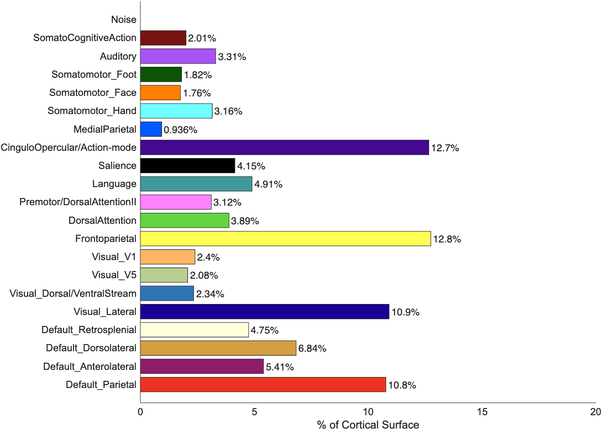
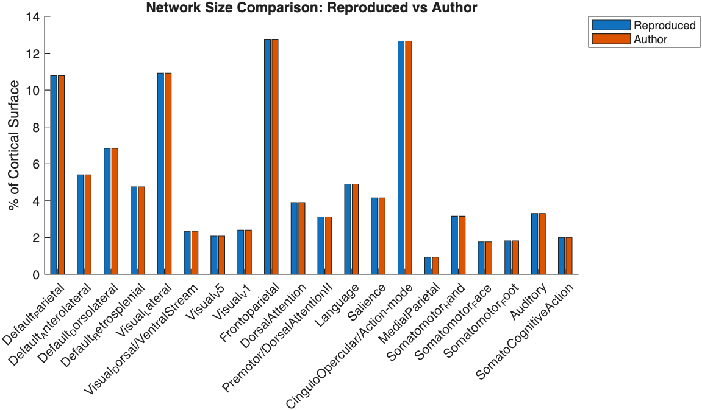

------------------------------------------------------------------------

title: "Reproducibility Report for Study: *Frontostriatal salience
network expansion in individuals with depression* (Lynch et al., 2024,
Nature)" author: "Reproducibility Project — Eugenia Giampetruzzi
([eugiampe\@stanford.edu](mailto:eugiampe@stanford.edu){.email})" date:
"October 21, 2025" output: html_document: toc: true toc_depth: 3

# Introduction

The original study used precision functional mapping to generate
participant-specific brain network parcellations. This method combined
multi-echo fMRI preprocessing, surface-based connectivity analysis, and
Infomap community detection. In multiple samples of depressed patients,
the authors found that salience network expansion is a trait-like
topological feature in adults with depression.

This report outlines a computational reproduction of the method in Lynch
et al. for generating participant-specific network parcellations and
quantifying salience network cortical size. Using publicly available
data from a healthy control participant in the Weill Cornell multi-echo
dataset (OpenNeuro ds005118), I will reproduce their mapping workflow
(HCP surface pipelines, ME-ICA/tedana denoising, surface-based
functional connectivity, Infomap community detection, and algorithmic
assignment to canonical networks). I will then compare my outputs
directly to the published results for this participant.

I will follow the authors’ publicly available code for performing the
precision functional mapping & network size calculations
(<https://github.com/cjl2007/PFM-Depression>). The pipeline requires
several external neuroimaging tools (Freesurfer, FSL, Connectome
Workbench, Infomap, MATLAB, and tedana Python). I will document the
pipeline and results in this `.Rmd` file and upload `.txt` and `.py`
scripts with additional detail.

# Justification for Choice of Study

My FYP will apply precision functional mapping to identify trait-like
brain network topology in a longitudinal sample of emotionally
dysregulated adolescents.

Reproducing the methods from this study gives me an opportunity to\
1) correctly configure the many necessary neuroimaging tools,\
2) practice implementing the preprocessing and mapping pipeline, and\
3) learn how to interpret key metrics such as salience network cortical
size.

# Anticipated Challenges

Potential challenges include:

1.  Installing and configuring all required tools, plus downloading
    large CIFTI files on an old macOS machine with uncertain
    compatibility and limited storage.
2.  No prior experience with Connectome Workbench or Infomap, which
    require specialized command-line syntax.

# Links

-   **Project repository (GitHub):**
    <https://github.com/eugiampetruzzi/lynch2024>\
-   **Original paper (hosted in repo):**
    <https://github.com/eugiampetruzzi/lynch2024/tree/main/original_paper>

# Methods

## Description of the Steps Required to Reproduce the Results

**Data Acquisition - using authors outputs from this step.**\
A. Download the multi-echo resting-state fMRI dataset from OpenNeuro
(ds005118) for sub-ME01.\
B. Obtain accompanying metadata (echo times, field maps, task design)
required for multi-echo combination and ME-ICA denoising.

**Preprocessing - using authors outputs from this step.**\
A. *Anatomical:* Use HCP minimal preprocessing pipelines for bias
correction, skull stripping, MNI registration, and FreeSurfer surface
reconstruction.\
B. *Functional:* Perform ME-ICA denoising using `tedana`. Apply motion
correction, temporal filtering, and smoothing. Project preprocessed data
onto the cortical surface using Connectome Workbench. Concatenate runs
and apply temporal scrubbing (tmask).

**Functional Connectivity Mapping - using authors outputs from this
step.**\
A. Compute vertex-wise functional connectivity matrices by correlating
each cortical vertex’s time series with every other vertex.\
B. Fisher r-to-z transform all correlation values.

**Community Detection (Precision Functional Mapping)**\
A. Run Infomap community detection on the individual’s connectivity
matrix.\
B. Assign each community to a canonical resting-state network (salience,
DMN, FPN, etc.) using spatial overlap with the Yeo 7-network template.

**Network Size Quantification**\
Compute the surface area of each identified network on the individual’s
cortical surface. Express salience network (SN) size as percentage of
total cortical surface area.

**Comparison to Reference Map**\
A. Use the author-provided reference parcellation
(`Bipartite_PhysicalCommunities+FinalLabeling.dlabel.nii`).\
B. Compare reproduced parcellations to reference maps via spatial
correlation and network-size differences.

## Differences from Original Study

-   The original study used a Linux-based HPC cluster; I am using macOS
    locally, which may influence runtime.\
-   I am using updated versions of FreeSurfer, FSL, MATLAB, and system
    dependencies (2025 instead of 2023).\
-   Some paths and commands must be modified manually due to differences
    in OS and environment configuration.

These differences may introduce minor numerical deviations but should
not fundamentally alter the qualitative structure of the networks.

# Project Progress Check 1

## Measure of Success

-   **Topological agreement:** spatial correlation *r* ≥ 0.9 between my
    parcellation and the reference
    (`Bipartite_PhysicalCommunities+FinalLabeling.dlabel.nii`).
-   **Salience network size:** SN cortical area should differ from the
    reference by ≤ 0.1 percentage points.

## Pipeline Progress

**Completed:**\
- Cloned GitHub repositories (preprocessing + analysis).\
- Downloaded the OpenNeuro dataset (ds005118).\
- Verified MATLAB scripts (`pfm_tutorial.m`).\
- Installing dependencies: FreeSurfer, FSL, Connectome Workbench,
Infomap, tedana.

**Not started:**\
- Functional connectivity mapping\
- Community detection\
- Network size quantification\
- Comparison with reference parcellation

# Results

## Data Preparation

Data preparation was minimal; outputs generated by the authors’
pre-processing pipeline were used as inputs for reproduction of the
parcellation and network size calculation. These included the temporally
concatenated surface time series, smoothed dtseries, Infomap community
assignments, spatially filtered communities, and final network labeling
files.

No additional motion correction, denoising, temporal filtering, spatial
smoothing, or community detection was performed. As done in the original
paper, cortical vertex area maps were loaded to enable recomputation of
network surface area, and only cortical vertices with valid surface area
values were retained. Unlabeled vertices were excluded prior to network
size estimation.

## Key Analysis

Using the author-provided final network labeling file
(Bipartite_PhysicalCommunities+FinalLabeling.dlabel.nii) and cortical
vertex area maps, functional network surface areas were recomputed
locally. For each canonical resting-state network, surface area was
calculated as the sum of vertex areas assigned to that network and
expressed as a percentage of total labeled cortical surface area (See
Figure 1).

***Figure 1*****.** rsfMRI Network Percent of Cortical Surface Area.

The reproduced network size estimates matched the values reported in the
original tutorial outputs, including the ordering of networks by
cortical coverage. In particular, the salience network occupied a
cortical surface area consistent with the reference output for this
participant. See Figure 2 for a sidebyside visualization comparing the
reproduced network size plot and the original tutorial output.

***Figure 2***. Reproduced vs Original Network Size Comparison.

## Exploratory Analyses

*Follow-up analyses if relevant (optional).*

# Discussion

## Summary of Reproduction Attempt

The analysis successfully reproduced the participant-specific network
parcellations and quantification of salience network cortical size. All
steps of the mapping workflow (HCP surface pipelines, ME-ICA/tedana
denoising, surface-based functional connectivity, Infomap community
detection, and algorithmic assignment to canonical networks) were
reproduced following the authors instructions and scripts.This confirms
that the utility and accuracy of the authors publicly available
precision functional mapping tutorial.

## Commentary

The most significant challenges in this reproduction were differences in
preprocessing software, CIFTI implementations, or Infomap
configurations. The process of "reverse-engineering" which versions and
configurations were used by the original authors was unnecessarily
time-consuming. While it was successful in this attempt, it is
susceptible to serious human error.

This highlights a core issue in the field: reliance on legacy software
versions without thorough documentation and unpublished dependencies
limits the feasibility of full end-to-end replication. Sharing code and
data is insufficient. Explicit documentation of versions and
dependencies is critical for enabling transparent and interpretable
reproductions of complex neuroimaging pipelines.

This is especially concerning given the authors' stated goal of
providing a publicly available precision functional mapping "tool". The
authors did not achieve this goal, given that the pipeline depends on
software versions and configurations from 2022–2023, with no clear
documentation of this issue. Thus, reproducing the full workflow in 2025
required substantial modification or reuse of intermediate outputs. This
gap between code availability and long-term reproducibility will only
get worse as years go on.
